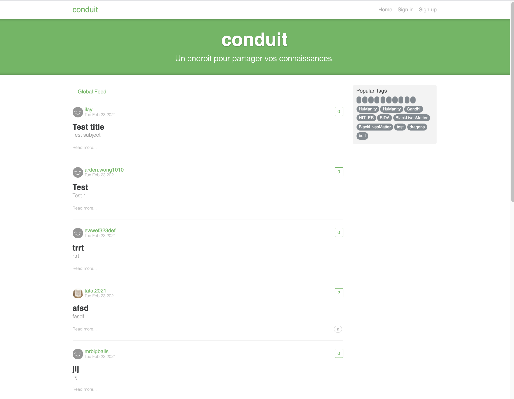
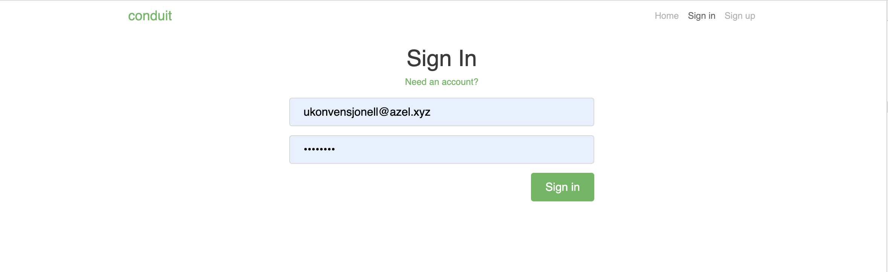
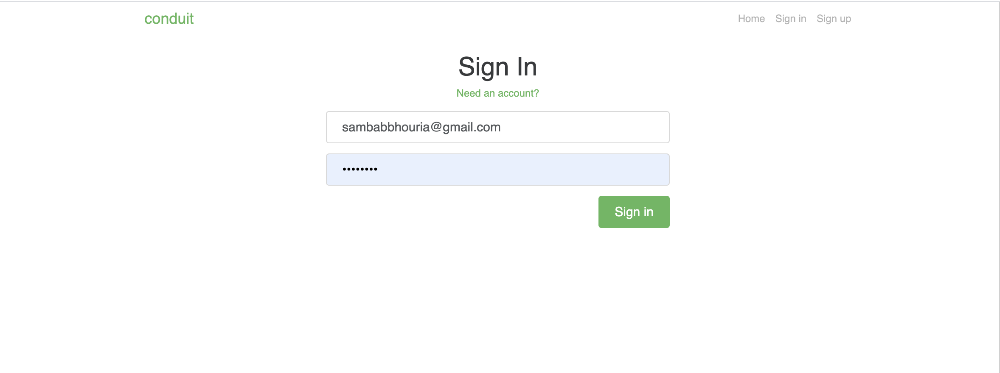
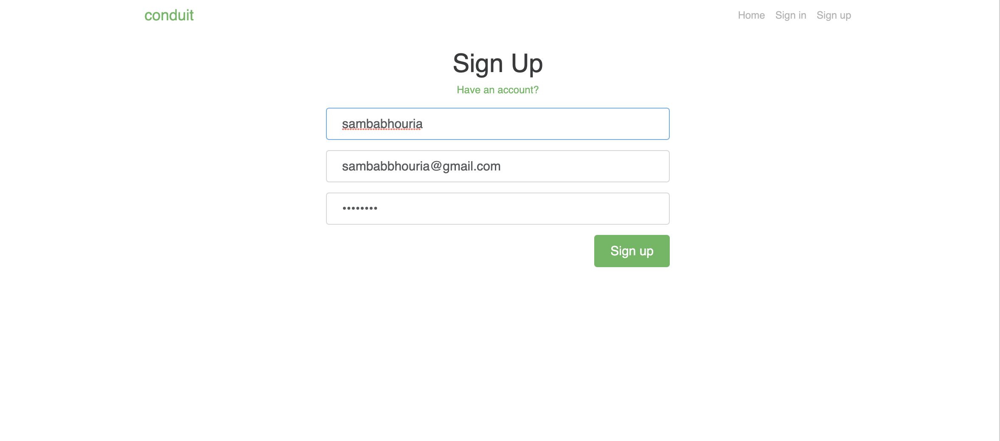
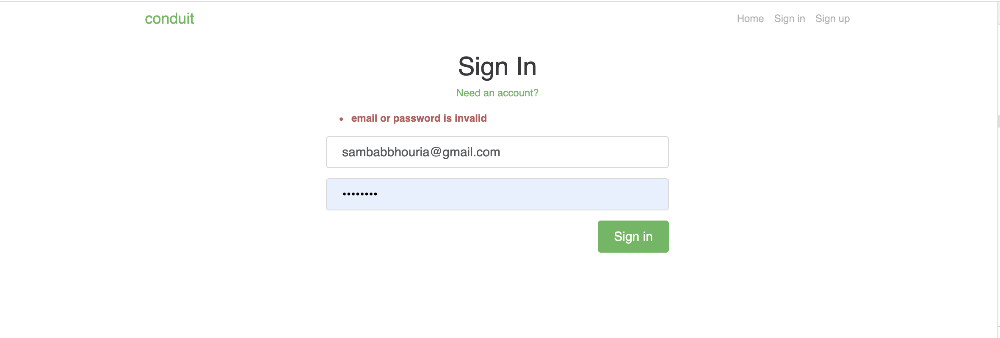

# Getting Started with Create React App

This project was bootstrapped with [Create React App](https://github.com/facebook/create-react-app).

## Available Scripts

In the project directory, you can run:

### `yarn start`

Runs the app in the development mode.\
Open [http://localhost:3000](http://localhost:3000) to view it in the browser.

The page will reload if you make edits.\
You will also see any lint errors in the console.

### `yarn test`

Launches the test runner in the interactive watch mode.\
See the section about [running tests](https://facebook.github.io/create-react-app/docs/running-tests) for more information.

### `yarn build`

Builds the app for production to the `build` folder.\
It correctly bundles React in production mode and optimizes the build for the best performance.

The build is minified and the filenames include the hashes.\
Your app is ready to be deployed!

See the section about [deployment](https://facebook.github.io/create-react-app/docs/deployment) for more information.

### `yarn eject`

# `Functionality overview
  ### `General functionality:`
    Authenticate users via JWT (login/signup pages + logout button on settings page)
    CRU* users (sign up & settings page - no deleting required)
    CRUD Articles
    CRUD Comments on articles (no updating required)
    GET and display paginated lists of articles
    Favorite articles
    Follow other users

# `The general page breakdown looks like this:
    Home page (URL: /#/ )
    List of tags
    List of articles pulled from either Feed, Global, or by Tag
    Pagination for list of articles
    Sign in/Sign up pages (URL: /#/login, /#/register )
    Use JWT (store the token in localStorage)
    Settings page (URL: /#/settings )
    Editor page to create/edit articles (URL: /#/editor, /#/editor/article-slug-here )
    Article page (URL: /#/article/article-slug-here )
    Delete article button (only shown to article's author)
    Render markdown from server client side
    Comments section at bottom of page
    Delete comment button (only shown to comment's author)
    Profile page (URL: /#/@username, /#/@username/favorites )
    Show basic user info
    List of articles populated from author's created articles or author's favorited articles

### `screenShot`

